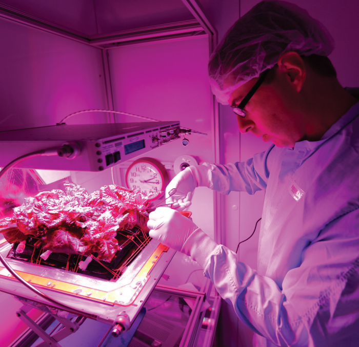
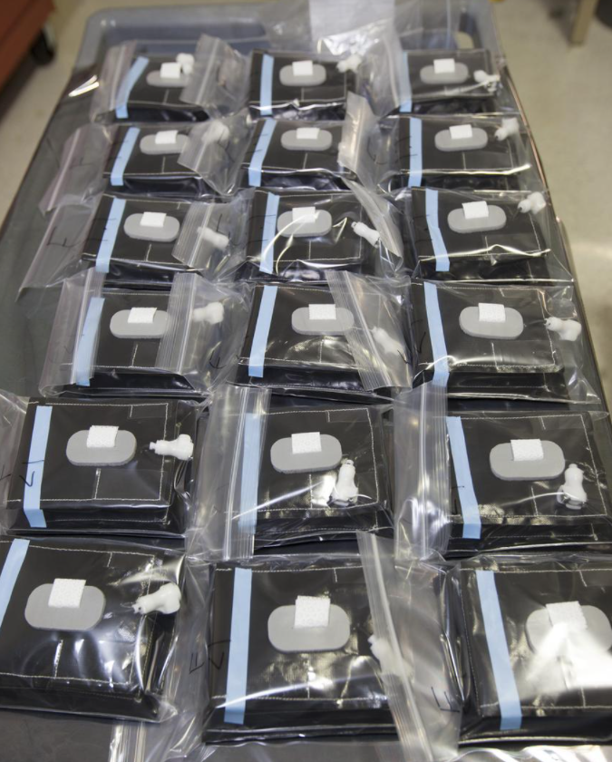
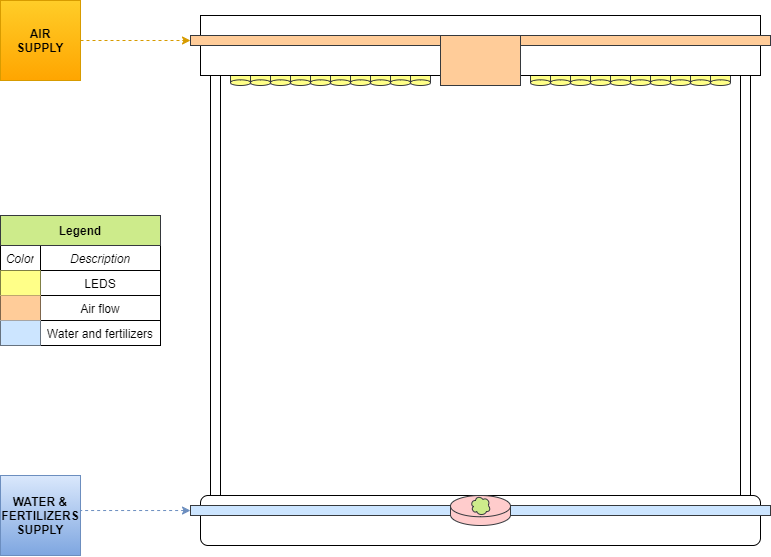
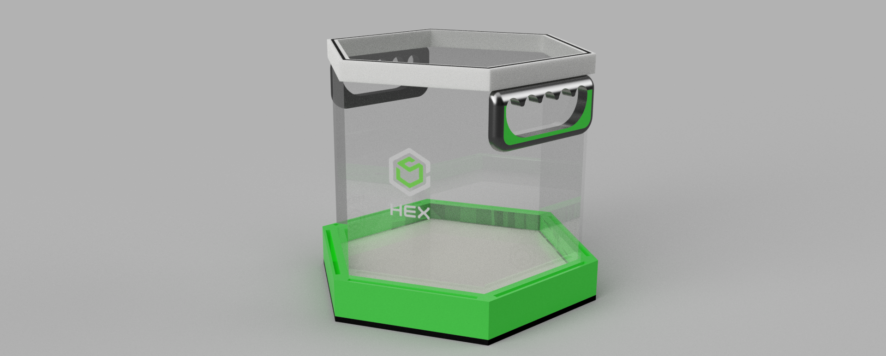
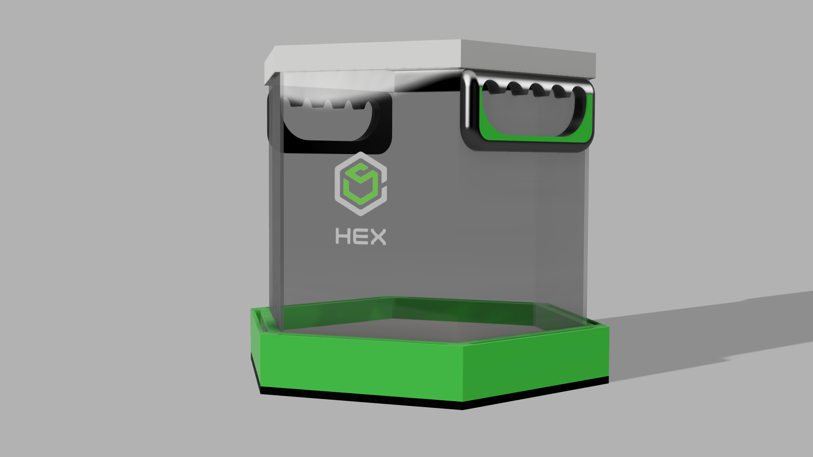
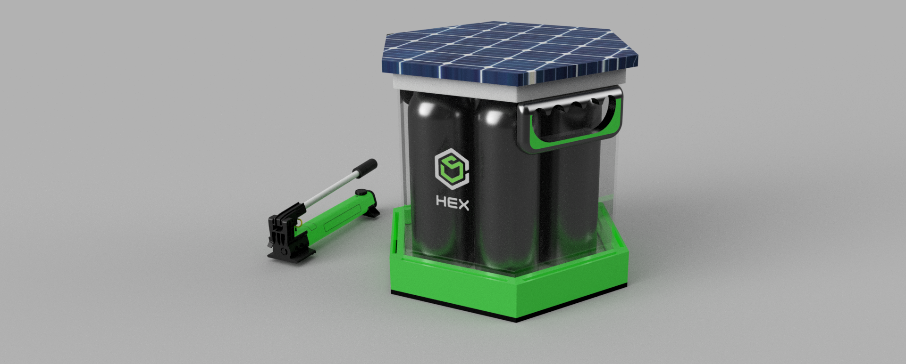
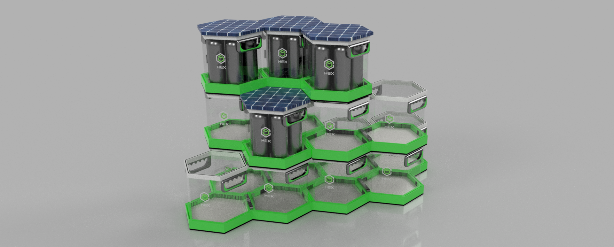
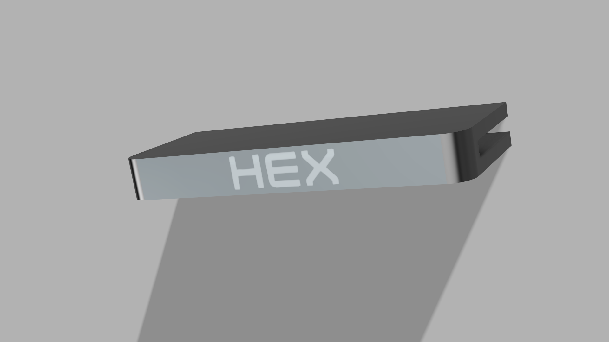
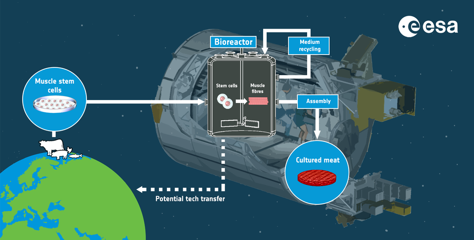
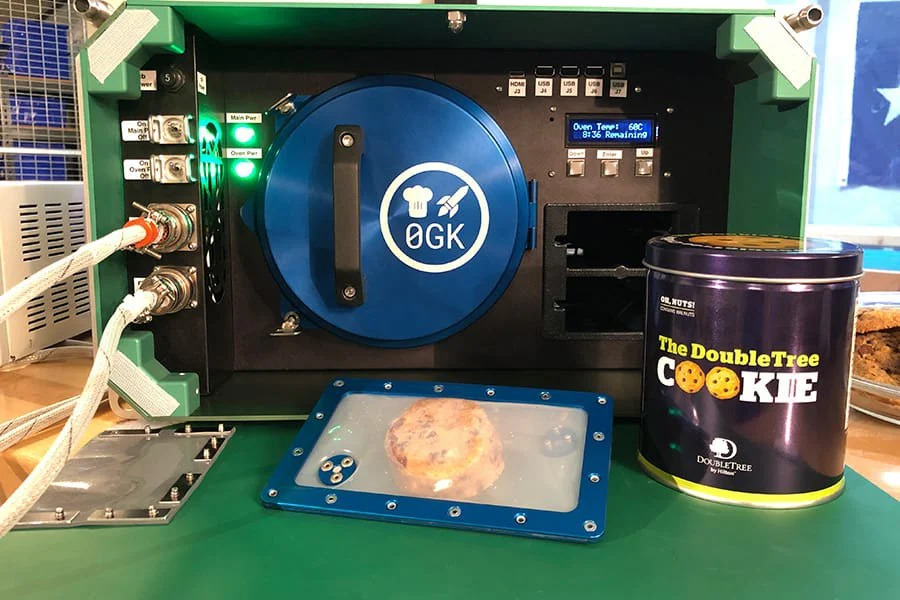

# **HEX - Challenge: Have Seeds Will Travel!**

## Table of Contents
1. [About Us](#About-Us)
    1. [Why HEX?](#Why-HEX?)
2. [Introduction](#Introduction)
    1. [Space Gastronomy](#Space-Gastronomy)
    2. [State-of-Art](#State-of-Art)
        1. [Vegetable Production System (Veggie)](#Vegetable-Production-System-(Veggie))
        2. [Advanced Plant Habit (APH)](#Advanced-Plant-Habit-(APH))
3. [Proposal](#Proposal)
    1. [Project Overview](#Project-Overview)
    2. [3D Model](#3D-Model)
    3. [Flowchart](#Flowchart)
4. [Conclusion](#Conclusion)
5. [Future Work](#Future-Work)
6. [References](#References)

## **About Us**

We are a team of mechatronic engineers that seeks to solve problems in the area of ​​agriculture, and in this competition, NASA gives us the opportunity to solve similar problems but in space.

We developed a modular smart growing system, which will allow the crew to plant on Mars.

Through a modular design, stackable, resistant to the conditions of Mars, and practical.

We provide the solution to the feeding of a crew of 4-6 people, focusing on vitamins and nutritional contributions under the selected crops.

We approach this challenge under a modular concept, easy to implement and that compromises the crew's time as little as possible so that they can focus on their assigned tasks for the mission.

The system has an intelligent terrarium, an intelligent power distributor and unions that allow with solar energy to have crops in production on Mars


## **Introduction**

### -> Space Gastronomy

Nutrition plays a key role in maintaining the health and optimal performance of astronauts before, during, and after spaceflight. Food flown on-orbit is not only required to be nutritious, but also must be appetizing, since it plays a critical social and psychological role during an astronaut's mission. <sup>[1](https://www.nasa.gov/content/space-food-systems)</sup>

At present, the Space Food Systems team is required to meet the nutritional needs of each crew member while adhering to the requirements of food safety, limited storage space, limited preparation options, and the difficulties of eating in microgravity. Crew members have the opportunity to supplement a few of their standard menu choices with commercial off-the-shelf items or personal favorites which provide them comfort while away from home. <sup>[1](https://www.nasa.gov/content/space-food-systems)</sup>

However, pre-packaged food won't be a solution for long-duration and exploration-class missions. When crews venture further into space, traveling for months or years without resupply shipments, the vitamins in prepackaged form break down over time, which presents a problem for astronaut health. <sup>[2](https://www.nasa.gov/content/growing-plants-in-space)</sup>

### -> State-of-Art

NASA is looking to create food production systems to provide astronauts with nutrients in a long-lasting, easily absorbed form—freshly grown fresh fruits and vegetables in the challenging environment of deep space. <sup>[2](https://www.nasa.gov/content/growing-plants-in-space)</sup>

#### **Vegetable Production System (Veggie)**

The Vegetable Production System, known as **Veggie**, is a space garden residing on the space station, specially designed for studying plant growth in microgravity, while adding fresh food to the astronauts’ diet. In the absence of gravity, plants use other environmental factors, such as light, to orient and guide growth. A bank of light emitting diodes (LEDs) above the plants produces a spectrum of light suited for the plants’ growth. <sup>[2](https://www.nasa.gov/content/growing-plants-in-space)</sup>

The Veggie garden is about the size of a carry-on piece of luggage and typically holds six plants. 



**Figure X** - A portion of of the 'Outredgeous' red romaine lettuce from the VEG-03 ground control unit. Recovered from [Veggie's Fact Sheet](https://www.nasa.gov/sites/default/files/atoms/files/veggie_fact_sheet_508.pdf)

Each plant grows in a “pillow” filled with a clay-based growth media and fertilizer. The pillows are important to help distribute water, nutrients and air in a healthy balance around the roots. Otherwise, the roots would either drown in water or be engulfed by air because of the way fluids in space tend to form bubbles. <sup>[2](https://www.nasa.gov/content/growing-plants-in-space), [3](https://blogs.nasa.gov/kennedy/2016/04/08/veg-03-plant-pillows-readied-at-kennedy-space-center-for-trip-to-space-station/)</sup>



**Figure X** - 18 plant pillows for the Veg-03 experiment prepared for delivery to the International Space Station aboard the eighth SpaceX Dragon commercial resupply mission. Recovered from [NASA Image and Video Library](https://images.nasa.gov/details-KSC-20160323-PH-DNG01_0003.html)

Throughout many experiments, the veggie project attempted to ripen many seeds for human-consumption purposes, as well as non-consumable. Among the consumable crops, we can find 'Red Russian' lettuce, *Mizuna* mustard, chinese cabbage, and some more. These vegetables contains significant amount of minerals and vitamins, which are quintessential for a balanced and complete nutrition, and the last stages successfully demonstrated its production <sup>[4](https://www.nasa.gov/sites/default/files/atoms/files/veggie_fact_sheet_508.pdf)</sup>

Although the implemented design shows that is possible to make many seeds grow in zero-gravity environment, it is not stackable, which means that it cannot be assembled one above other. Instead, it just expands horizontally, which can be troublesome for the reduced amount of space that the crowd already faces.


#### **Advanced Plant Habit (APH)**

The Advanced Plant Habitat (APH) is a growth chamber on station for plant research. It uses LED lights and a porous clay substrate with controlled release fertilizer to deliver water, nutrients and oxygen to the plant roots <sup>[2](https://www.nasa.gov/content/growing-plants-in-space)</sup>

This system differs from the Vegetable Production System (Veggie) since it is enclosed and automated with cameras and more than 180 sensors that are in constant interactive contact with a team on Earth at Kennedy Space Center. Its water recovery and distribution, atmosphere content, moisture levels and temperature are all automated. Compare to Veggie, it has more colors of LED lights including red, green, blue, white, far red and even infrared to allow nighttime imaging <sup>[2](https://www.nasa.gov/content/growing-plants-in-space)</sup>


**Figure X** - First growth test of crops in the Advanced Plant Habitat aboard the International Space Station. (Arabidopsis seeds)

Even though the system is highly automated, it ultimately depends from human intervention at the Kennedy Space Center which is not suitable for missions at very long distances where the communication could be delayed for minutes or even hours regarding of the distance and bandwidth.

## **Proposal**


**MORE FEASIBLE TO PRODUCE:**


The following list of crops contains some of the most relevant vegetables, about which more has been experimented throughout the history of space cultivation<sup>[5](https://www.degruyter.com/document/doi/10.1515/opag-2017-0002/html),[6](https://www.researchgate.net/publication/228484167_Plants_for_human_life_support_in_space_From_Myers_to_Mars)</sup>. The first column specifies the crop or vegetable, the second one contains some of the relevant minerals and vitamins for each vegetable, along with its online source in the third column.


| CROP        	| REVELANTS MINERALS CONTAINED                                  	| SOURCE                                                                   	|
|-------------	|---------------------------------------------------------------	|--------------------------------------------------------------------------	|
| Lettuce     	| Vitamins {A, B9, C, K}, POTASSIUM, CALCIUM, PROTEIN           	| [Romaine Lettuce: Nutrition, Calories, and Recipes](https://www.healthline.com/health/food-nutrition/romaine-lettuce#nutrition-facts)       	|
| Wheat       	| Vitamins {B6, B9 or Folate}, PROTEIN, FIBER, CALCIUM          	| [Wheat 101: Nutrition Facts and Health Effects](https://www.healthline.com/nutrition/foods/wheat#plant-compounds)           	|
| Swiss chard 	| Vitamins {A, C, E, K}, PROTEIN, CALCIUM, POTASSIUM, FIBER     	| [Swiss Chard: Nutrition, Benefits and How to Cook It](https://www.healthline.com/nutrition/swiss-chard#nutrition)     	|
| Radish      	| Vitamins {B6, B9, K}, POTASSIUM, CALCIUM, MAGNESIUM, PROTEIN  	| [Are Radishes Good for You?](https://www.healthline.com/health/food-nutrition/the-benefits-of-radishes#5-health-benefits-of-radishes)                              	|
| Cabbage     	| Vitamins {B6, B9, C, K}, CALCIUM, FIBER, POTASSIUM, PROTEIN,  	| [9 Impressive Health Benefits of Cabbage](https://www.healthline.com/nutrition/benefits-of-cabbage#TOC_TITLE_HDR_2)                 	|
| Peas        	| Vitamins {B6, B9}, PROTEIN, FIBER, POTASSIUM,                 	| [Black-Eyed Peas (Cowpeas): Nutrition Facts and Benefits](https://www.healthline.com/nutrition/black-eyed-peas-nutrition#uses) 	|
| Rice        	| CARBOHYDRATES, PROTEIN (BUT IN SMALL QUANTITY)                	| [Is Rice a Grain?](https://www.healthline.com/nutrition/is-rice-a-grain#bottom-line)                                        	|
| Onion       	| Vitamins {B6, B9, C}, POTASSIUM, FIBER, PROTEIN               	| [Onions 101: Nutrition Facts and Health Effects](https://www.healthline.com/nutrition/foods/onions#nutrients)          	|
| Garlic      	| Vitamins {B1, B6, C}, FIBER, CALCIUM, POTASSIUM               	| [11 Proven Health Benefits of Garlic](https://www.healthline.com/nutrition/11-proven-health-benefits-of-garlic#TOC_TITLE_HDR_4)                     	|
| Cucumber    	| Vitamins {B, C, K}, POTASSIUM, PROTEIN, FIBER                 	| [Is Cucumber Good for Diabetes?](https://www.healthline.com/health/is-cucumber-good-for-diabetes#cucumber)                          	|
| Potato      	| Vitamins {B6, B9, C}, POTASSIUM, FIBER, PROTEIN               	| [7 Health and Nutrition Benefits of Potatoes](https://www.healthline.com/nutrition/benefits-of-potatoes#TOC_TITLE_HDR_5)             	|
| Mizuna mustard      	| Vitamins {A, C, K}, CALCIUM, PROTEIN               	| [What Is Mizuna? All About This Unique, Leafy Green](https://www.healthline.com/nutrition/mizuna)             	|


https://www.nasa.gov/sites/default/files/atoms/files/veggie_fact_sheet_508.pdf

Among these, the crops that stand out not only for their richness and nutritional variety, but also for the reliability they present at the moment of being conceived for consumption in a prudent time, have been selected <sup>[4](https://www.nasa.gov/sites/default/files/atoms/files/veggie_fact_sheet_508.pdf)</sup>. Some of the most important vitamins (Group B, C, K) are emphasized, along with minerals of utmost importance for body integrity (fiber, calcium, magnesium, potassium, etc.). Many of these were implemented in Veggie & ADP projects <sup>[7](https://www.nasa.gov/mission_pages/station/research/Giving_Roots_and_Shoots_Their_Space_APH)</sup>.

- **Lettuce**: To be precise, *'Outredgeous’ red romaine lettuce*, cultivated in the Veggie project. []() 
- **Radish**: Cultivated in the APH project, during the Plant Habitat-02 (PH-02) experiment. [8](https://www.nasa.gov/feature/astronauts-harvest-radish-crop-on-international-space-station)
- **Cabbage**: To be precise, *'Tokyo Bekana' Chinese cabbage*, cultivated in the Veggie project. []()
- **Mustard**: To be precise, *Mizuna mustard*, cultivated in the Veggie project. []()
- **Wheat**: Cultivated in the APH project. 

LETTUCE, WHEAT, RADISH, CABBAGE, MUSTARD

### Project Overview

We designed a modular system capable of deploying individual pots where a crop will be planted, grown and harvested. These pots will act as an enclosed environment for the crop to get the right temperature, light, humidity level, air flow, water and fertilizers. Both water and fertilizers will be injected through a vascular system integrated in the pots, reaching the points where the plant can access to them through wicking (similar as _Veggie_ does). [X](https://www.nasa.gov/sites/default/files/atoms/files/veggie_fact_sheet_508.pdf)

The purpose of this design is to make the most of the available space of the vehicle. We visualize that at the beginning of the journey, most of the stowage space will be occupied by prepackaged food, and a little space will have our HEX pots un-assembled. While the crew eats the food, the space from the prepackaged food will be free, so the astronauts will be deploying the HEX pots in that space and planting the crops. This will keep a continuous food production system even when the prepackaged food finally depletes.

### Diagrams

The following diagram shows the main components of a HEX pot. The air flow system consists of air conduits where the gases will flow, and a fan to provide the force needed bla bla bla. Nobushaequisde.



**Figure X** - Systems present on each HEX Pot

Since the HEX pots has a modular design, every single face at the base and top of the pots has a port to connect to the water and fertilizer system, and air flow system of other HEX pot. With a HEX union (shown at the figure X), the pots seals hermetically the ports and also this union provides electrical conductivity to supply other pots with energy.


**Figure X** - Top view from a HEX Pot. This shows how each face has an access to connect to any other HEX Pot.

## **3D Model**
We develop a solution using reliable sources.

We exhaust the design process from the selection of relevant materials for this application, to the system approach in question.

The model consists of 3 important elements, the main unit where the crops will be, the energy supply unit, where we will have the inputs for the plants and can be recharged by solar energy, and some couplings that connect the modules electrically and physically. individual.

This means that our proposal is stackable, modular and interconnected. Which puts us in front of a system designed for efficient storage and operability.

The materials used for the main module were:

- Transparent panel: polycarbonate with antistatic agents, and antioxidants additives
- Gripper, support frame: High Density Polyethylene (HDPE)
- Base: Rubber

The main unit is a hexagonal smart terrarium, with materials able to withstand the context of a mission to Mars, to interconnect with other terrariums and to keep the crops in optimal conditions for their growth.

At the design stage, we take into account the ease and maneuverability of the individual elements when positioning them inside and outside the warehouse.

The proposed solution will put at the command of a space crew a crop that meets the nutritional and vitamin contributions they need, with a crew of 4-6 people on board.




**Figure X** - HEX



**Figure X** - HEX



**Figure X** - HEX



**Figure X** - HEX



**Figure X** - HEX


## **Conclusion**

## **Future Work**

- **Cultured Meat**: Not only crops could be grown in a restrained environment such as space, we believe that lab-grown meat will sum up to the food production ecosystem in space in the following years. In-vitro meat production is not a new technology on Earth, and even in September of 2019 the first cultured meat was cultivated in space by *Aleph Farms* in partnership with *Bioprinting Solutions*. This experiment was conducted by the cosmonaut Oleg Skripochka  at the International Space Station (ISS). <sup>[X](https://www.aleph-farms.com/aleph-zero), [X](https://www.space.com/meat-grown-in-space-station-bioprinter-first.html)</sup>. Recently, the European Space Agency (ESA) publish that they are seeking proposals to investigate the application of cellular agriculture to produce cultured meat during future long-term space mission. <sup>[X](https://www.esa.int/Enabling_Support/Preparing_for_the_Future/Discovery_and_Preparation/ESA_investigates_cultured_meat_as_novel_space_food)</sup>

    

- **Cooking and preparing complex food recipes:** With recent experiments related to cooking in space, the products obtained from the crops and cultured meat production systems allows astronauts to prepare more complex meals in space, improving both astronaut's nutrition and psychological state during their mission. An example of this new hardware is the Zero-G Kitchen Space Oven, which allowed astronauts to bake cookies at the International Space Station (ISS). <sup>[X](https://www.zerogk.space/space-oven)</sup>

    

    Here is a video of the cookies baked at the ISS:

    <iframe width="1904" height="800" src="https://www.youtube.com/embed/nHcvmpiP8k8" title="YouTube video player" frameborder="0" allow="accelerometer; autoplay; clipboard-write; encrypted-media; gyroscope; picture-in-picture" allowfullscreen></iframe>

## **References**

- [1] 

---

You can use the [editor on GitHub](https://github.com/chris-roman/HEX/edit/gh-pages/index.md) to maintain and preview the content for your website in Markdown files.

Whenever you commit to this repository, GitHub Pages will run [Jekyll](https://jekyllrb.com/) to rebuild the pages in your site, from the content in your Markdown files.

### Markdown

Markdown is a lightweight and easy-to-use syntax for styling your writing. It includes conventions for

```markdown
Syntax highlighted code block

# Header 1
## Header 2
### Header 3

- Bulleted
- List

1. Numbered
2. List

**Bold** and _Italic_ and `Code` text

[Link](url) and 
```

For more details see [GitHub Flavored Markdown](https://guides.github.com/features/mastering-markdown/).

### Jekyll Themes

Your Pages site will use the layout and styles from the Jekyll theme you have selected in your [repository settings](https://github.com/chris-roman/HEX/settings/pages). The name of this theme is saved in the Jekyll `_config.yml` configuration file.

### Support or Contact

Having trouble with Pages? Check out our [documentation](https://docs.github.com/categories/github-pages-basics/) or [contact support](https://support.github.com/contact) and we’ll help you sort it out.
